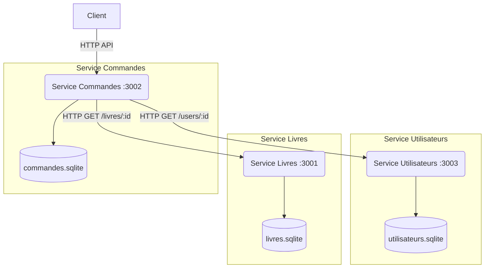
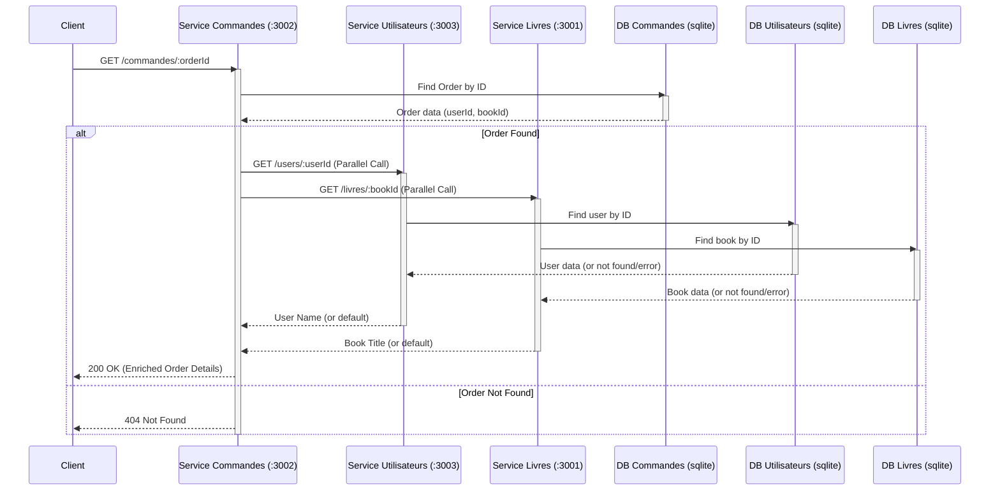

# Rapport d'Architecture : Système de Commande de Librairie (Microservices)

## 1. Introduction

Ce document décrit l'architecture du système de commande en ligne pour une librairie, implémenté en utilisant une approche microservices. Le système est composé de trois services principaux : gestion des utilisateurs, gestion du catalogue de livres et gestion des commandes.

## 2. Architecture Globale

Le système adopte une architecture microservice où chaque fonctionnalité métier principale est isolée dans son propre service. Chaque service possède sa propre base de données et communique avec les autres via des appels API REST synchrones (HTTP).



## 3. Description des Services

### 3.1. Service Utilisateurs (`service-utilisateurs`)

*   **Port:** 3003
*   **Rôle:** Gère l'inscription, l'authentification (basique par comparaison de hash) et la récupération des informations des utilisateurs.
*   **Données:** Base de données `utilisateurs.sqlite`.
    *   Modèle `User`: `id`, `email` (unique), `password` (hashé avec bcrypt), `name`.
*   **API Principale:**
    *   `POST /register`: Crée un nouvel utilisateur.
    *   `POST /login`: Vérifie les identifiants et retourne les informations utilisateur (sans le mot de passe).
    *   `GET /users/{id}`: Récupère les informations d'un utilisateur par son ID (sans le mot de passe).
*   **Dépendances Clés:** `express`, `sequelize`, `sqlite3`, `bcrypt`.
*   **Interactions Externes:** Aucune interaction directe avec les autres services.

### 3.2. Service Livres (`service-livres`)

*   **Port:** 3001
*   **Rôle:** Gère le catalogue des livres disponibles.
*   **Données:** Base de données `livres.sqlite`.
    *   Modèle `Book`: `id`, `title`, `author`, `year`.
*   **API Principale:** Fournit une API RESTful complète (CRUD) pour les livres.
    *   `GET /livres`: Liste tous les livres.
    *   `POST /livres`: Ajoute un nouveau livre.
    *   `GET /livres/{id}`: Récupère un livre par son ID.
    *   `PUT /livres/{id}`: Met à jour un livre existant.
    *   `DELETE /livres/{id}`: Supprime un livre.
*   **Dépendances Clés:** `express`, `sequelize`, `sqlite3`.
*   **Interactions Externes:** Aucune interaction directe avec les autres services.

### 3.3. Service Commandes (`service-commandes`)

*   **Port:** 3002
*   **Rôle:** Gère la création et la consultation des commandes passées par les utilisateurs. Agit comme un orchestrateur en communiquant avec les autres services pour valider et enrichir les données.
*   **Données:** Base de données `commandes.sqlite`.
    *   Modèle `Order`: `id`, `userId`, `bookId`, `dateCommande`, `status`.
*   **API Principale:**
    *   `POST /commandes`: Crée une nouvelle commande après validation de l'utilisateur et du livre.
    *   `GET /commandes`: Liste toutes les commandes, enrichies avec le nom de l'utilisateur et le titre du livre.
    *   `GET /commandes/{id}`: Récupère les détails d'une commande spécifique, enrichis.
*   **Dépendances Clés:** `express`, `sequelize`, `sqlite3`, `axios`.
*   **Interactions Externes:**
    *   Appelle `GET /users/{userId}` sur `service-utilisateurs` pour valider/récupérer les informations utilisateur.
    *   Appelle `GET /livres/{bookId}` sur `service-livres` pour valider/récupérer les informations du livre.

## 4. Flux de Communication Principaux

### 4.1. Création d'une Commande (`POST /commandes`)

Ce diagramme montre les étapes lorsqu'un client crée une nouvelle commande.

```mermaid
sequenceDiagram
    participant Client
    participant SC as Service Commandes (:3002)
    participant SU as Service Utilisateurs (:3003)
    participant SL as Service Livres (:3001)
    participant DB_C as DB Commandes (sqlite)
    participant DB_U as DB Utilisateurs (sqlite)
    participant DB_L as DB Livres (sqlite)

    Client->>SC: POST /commandes (userId, bookId)
    activate SC
    SC->>SU: GET /users/:userId
    activate SU
    SU->>DB_U: Find user by ID
    activate DB_U
    DB_U-->>SU: User data (or not found)
    deactivate DB_U
    alt User Found
        SU-->>SC: 200 OK (User details)
        deactivate SU
        SC->>SL: GET /livres/:bookId
        activate SL
        SL->>DB_L: Find book by ID
        activate DB_L
        DB_L-->>SL: Book data (or not found)
        deactivate DB_L
        alt Book Found
            SL-->>SC: 200 OK (Book details)
            deactivate SL
            SC->>DB_C: INSERT INTO Order (userId, bookId, ...)
            activate DB_C
            DB_C-->>SC: New Order ID
            deactivate DB_C
            SC-->>Client: 201 Created (Order details)
        else Book Not Found
            SL-->>SC: 404 Not Found
            deactivate SL
            SC-->>Client: 404 Livre non trouvé
        end
    else User Not Found
         SU-->>SC: 404 Not Found
         deactivate SU
         SC-->>Client: 404 Utilisateur non trouvé
    end
    deactivate SC
```

### 4.2. Récupération des Détails d'une Commande (`GET /commandes/{id}`)

Ce diagramme illustre comment le service Commandes récupère les détails d'une commande et les enrichit en appelant les autres services.



## 5. Technologies Utilisées

*   **Langage / Environnement d'exécution:** Node.js
*   **Framework Web:** Express.js
*   **Gestion de Base de Données:** Sequelize (ORM) avec SQLite
*   **Communication Inter-services:** API REST sur HTTP (Axios comme client HTTP)
*   **Documentation API:** Swagger (via `swagger-jsdoc` et `swagger-ui-express`)
*   **Sécurité:** `bcrypt` pour le hachage des mots de passe.

## 6. Synthèse & Points d'Attention

*   **Points Forts:**
    *   Architecture découplée en microservices, favorisant la modularité et la maintenance indépendante.
    *   Chaque service gère son propre domaine de données avec sa base de données dédiée.
    *   Utilisation de standards comme REST, Express, Sequelize.
    *   Documentation API intégrée (Swagger).
*   **Points d'Attention:**
    *   **Communication Synchrone:** Le service Commandes dépend fortement de la disponibilité des services Utilisateurs et Livres lors de la création et la consultation des commandes. Une défaillance dans l'un de ces services impactera directement le service Commandes. Des patterns comme la communication asynchrone (par message queue) pourraient améliorer la résilience.
    *   **Authentification/Autorisation:** L'authentification est basique (login/password). Une solution basée sur des tokens (ex: JWT) serait nécessaire pour sécuriser les appels API entre services et pour le client final dans une application réelle.
    *   **Gestion des Erreurs:** La gestion des erreurs lors des appels inter-services est présente mais pourrait être affinée (ex: implémentation de retries, circuit breakers).
    *   **Configuration:** Les URLs des services sont codées en dur. L'utilisation de variables d'environnement ou d'un service de configuration/découverte serait préférable.
    *   **Base de données:** SQLite est utilisé, ce qui est simple pour le développement mais pourrait ne pas convenir pour une mise en production à grande échelle (considérer PostgreSQL, MySQL, etc.).
